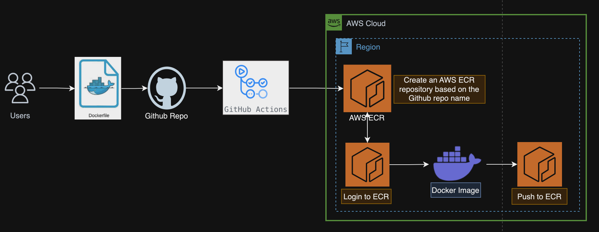

# Docker ECR Actions Workflow

This repository contains the reusable workflow for building and publishing Docker images.
Provides steps on how to automate the build process of your Dockerfiles using Terraform and Github actions, this minimizes the possibility of human error and substantially reduces the deployment time.

Deployment of resources can be triggered upon Github ‘push’ action to the main branch of your github repository.
Or it can configured to be executed manually from the Github Actions console using the flag "workflow_dispatch".

This solution has the flag as "workflow_dispatch", but this can be replaced with "push" to trigger the workflows on every push; more details can be found [here](https://docs.github.com/en/actions/using-workflows/triggering-a-workflow).

## Table of content
- [Docker ECR Actions Workflow](#docker-ecr-actions-workflow)
  - [Table of content](#table-of-content)
  - [Summary of build steps](#summary-of-build-steps)
  - [Prerequisites](#prerequisites)
  - [Setup](#setup)
  - [Architecture](#architecture)
  - [How to Use](#how-to-use)
  - [ECR Policy](#ecr-policy)
  - [Best practices](#best-practices)
  - [Limitations](#limitations)
  - [Contributing](#contributing)
  - [License](#license)
  - [Contributors](#contributors)

## Summary of build steps

- Build the image according to the Dockerfile
- Ensure an ECR repository for this GitHub repository exists
- Tag and publish the image to the ECR repository

## Prerequisites
- An active AWS account
- Github Account
- A Github Repository created
- Terraform v1 or above installed and configured.
- An S3 bucket for the Terraform Backend
- A DynamoDB table for Terraform State Locking and consistency. The table must have a partition key named LockID with type of String. If not configured, state locking will be disabled.

## Setup
- Dockerfile and any build-related data
- policy.json to dictate the ECR lifecycle policy

## Architecture


## How to Use
The reusable Github Actions workflow template is available under the folder ".github/workflows". As mentioned above the action to trigger the workflow is currently set to "workflow_dispatch", but this can be changed to "push" or "workflow_call" based on your required. for more information check [here](https://docs.github.com/en/actions/using-workflows/triggering-a-workflow)

A sample Dockerfile is added under the directory "e2e-test", this is just for reference and execution of the pipeline.

1. Either edit the ".github/workflows/workflow.yaml" file to update the inputs. This can also be passed via the console when triggering manually.
2. Make sure to pass the right AWS Account ID and region as Inputs.
3. A sample ECR lifecycle policy is added here at "e2e-test/policy.json". Refer next section for more information.
4. Two IAM roles are required as inputs:
  a. An IAM role with permissions to setup the Terraform S3 backend and provided as input `backend_iam_role`
  b. An IAM role with permissions to Github, which is also used in the ECR policy to restrict ECR operations, refer `data.tf` file.

## ECR Policy
Example `policy.json` (find some other [examples here](https://docs.aws.amazon.com/AmazonECR/latest/userguide/lifecycle_policy_examples.html)):

```json
{
  "rules": [
    {
      "rulePriority": 1,
      "description": "Keep last 30 images",
      "selection": {
        "tagStatus": "tagged",
        "tagPrefixList": [ "prod" ],
        "countType": "imageCountMoreThan",
        "countNumber": 30
      },
      "action": {
        "type": "expire"
      }
    }
  ]
}
```

## Best practices
Please make sure to follow provided best practices, as this is not in the scope of this solution.
- [Best practices for writing Dockerfiles](https://docs.docker.com/develop/develop-images/dockerfile_best-practices/)
- [VPC Endpoint for ECR](https://docs.aws.amazon.com/vpc/latest/privatelink/create-interface-endpoint.html) :
    VPC endpoints are powered by AWS PrivateLink, a technology that enables you to privately access Amazon ECR APIs through private IP addresses. For Amazon ECS tasks using the Fargate launch type, the VPC endpoint enables the task to pull private images from Amazon ECR without assigning a public IP address to the task.

## Contributing
See [CONTRIBUTING](CONTRIBUTING.md#security-issue-notifications) for more information.

## License
This library is licensed under the MIT-0 License. See the LICENSE file.

## Contributors
* Ruchika Modi
